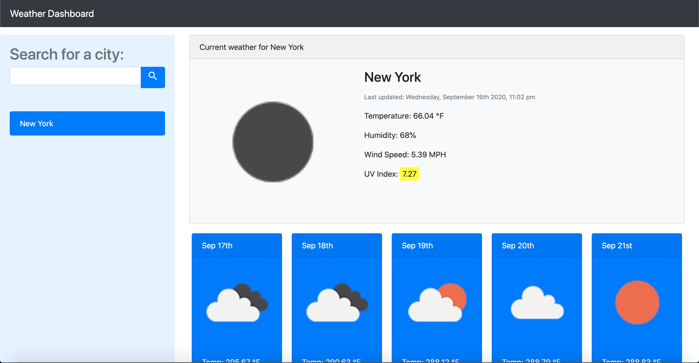

# Weather Dashboard

In this assignment, I curated a page that allows the user to search for a city, or to geo-locate to the current city of the user. There is the search bar on the left hand side where the local storage will display under. On the main interface (to the right) there is the forecast for the day, and below that is a 5 day forecast.

For this assignment, I familiarized myself with popper, geo-locate, temp equations, and other tools within JavaScript and HTML. 

live link: https://avatl.github.io/weather-hw6/

Set Backs:
    - I was unable to successfully change the temperature for the 5 day forecast from kelvin to fahrenheit, but I plan to make this change as soon as I am able to properly code this equation. I will resubmit this assignment once this issue is fixed. 
    - I <b>finally</b> learned how to insert an image in markdown languages (thank you Alison!) Next thing I will learn is adding gifs!